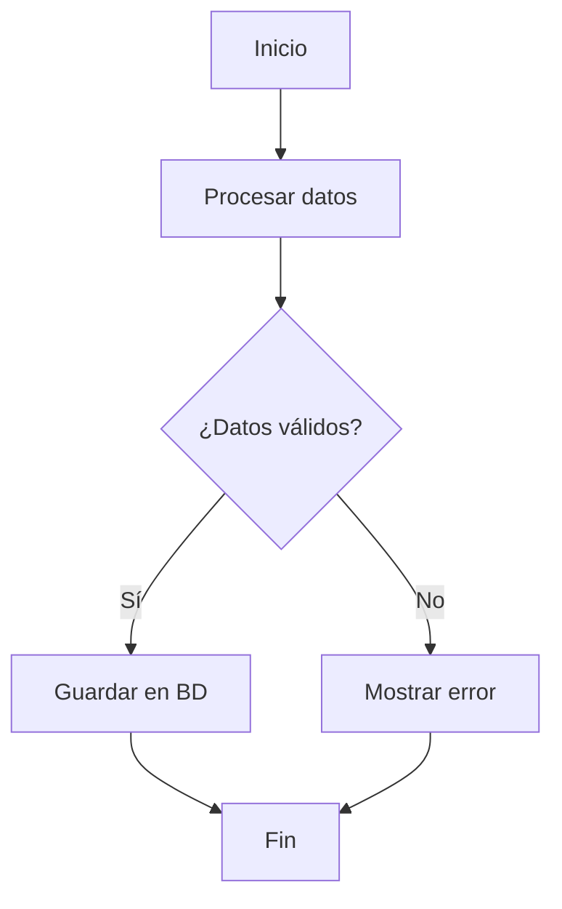

# 🎨 Figma REST API - Guía de Configuración

Esta guía te ayudará a conectar tu aplicación con Figma/FigJam para trabajar con flowcharts y diseños.

## 📋 Tabla de Contenidos

1. [Configuración Inicial](#configuración-inicial)
2. [Limitaciones Importantes](#limitaciones-importantes)
3. [Uso Básico](#uso-básico)
4. [Alternativas para Crear Flowcharts](#alternativas-para-crear-flowcharts)
5. [Ejemplos de Código](#ejemplos-de-código)

---

## 🔧 Configuración Inicial

### 1. Obtener Token de Acceso

1. Ve a [Figma Account Settings](https://www.figma.com/settings)
2. Scroll hasta **"Personal access tokens"**
3. Click en **"Generate new token"**
4. Nombre: `FigJam Flowchart Creator`
5. Scopes requeridos:
   - ✅ `file:read` - Leer archivos
   - ✅ `file:write` - Crear/modificar (para comentarios)
6. Copia el token generado

### 2. Obtener File Key

El File Key se encuentra en la URL de tu archivo de FigJam:

```
https://www.figma.com/file/ABC123XYZ/Mi-Flowchart
                              ↑↑↑↑↑↑↑↑↑
                              FILE_KEY
```

### 3. Configurar Variables de Entorno

Edita el archivo `.env.figma`:

```bash
FIGMA_ACCESS_TOKEN=figd_tu_token_aqui
FIGMA_FILE_KEY=ABC123XYZ
```

### 4. Instalar Dependencias

```bash
npm install
# o
yarn install
```

---

## ⚠️ Limitaciones Importantes

### ❌ Lo que NO puedes hacer con REST API

La Figma REST API **NO permite**:
- Crear nodos directamente en FigJam
- Modificar geometría de formas existentes
- Crear conexiones entre nodos
- Añadir widgets o componentes interactivos

### ✅ Lo que SÍ puedes hacer con REST API

- **Leer** contenido de archivos de Figma/FigJam
- **Exportar** nodos como imágenes (PNG, JPG, SVG, PDF)
- **Añadir comentarios** en posiciones específicas
- **Obtener versiones** del archivo
- **Listar y analizar** estructura de nodos existentes

---

## 🚀 Uso Básico

### Ejecutar Script de Prueba

```bash
# Con npm
npm install -g ts-node
ts-node src/scripts/createFlowchart.ts

# Con yarn
yarn global add ts-node
ts-node src/scripts/createFlowchart.ts
```

### Ejemplo en Código

```typescript
import { FigmaAPI } from './utils/figmaAPI';

const figma = new FigmaAPI(
  process.env.FIGMA_ACCESS_TOKEN!,
  process.env.FIGMA_FILE_KEY!
);

// Obtener información del archivo
const fileData = await figma.getFile();
console.log('Archivo:', fileData.name);

// Exportar un nodo como imagen
const exportData = await figma.exportNode('node-id', 'png', 2);
console.log('Imagen:', exportData.images['node-id']);

// Añadir un comentario
await figma.createComment('Revisar este flujo', { x: 100, y: 200 });
```

---

## 🎯 Alternativas para Crear Flowcharts

Dado que la REST API no permite crear nodos directamente, aquí hay alternativas:

### Opción 1: Figma Plugin API

Desarrolla un plugin de Figma que se ejecute dentro del entorno de Figma.

**Ventajas:**
- ✅ Acceso completo a la creación de nodos
- ✅ Control total sobre geometría y estilos
- ✅ Puede automatizar tareas complejas

**Desventajas:**
- ❌ Requiere ejecutarse dentro de Figma
- ❌ Más complejo de desarrollar

**Documentación:**
- [Figma Plugin API Docs](https://www.figma.com/plugin-docs/)

### Opción 2: Mermaid → FigJam

Usa Mermaid para definir flowcharts en texto, luego cópialos manualmente a FigJam.

**Ejemplo Mermaid:**



**Herramientas:**
- [Mermaid Live Editor](https://mermaid.live/)
- [Mermaid to Figma Plugin](https://www.figma.com/community/plugin/1234567890/Mermaid-to-FigJam)

### Opción 3: FigJam Widgets

Desarrolla un Widget personalizado para FigJam.

**Documentación:**
- [FigJam Widget API](https://www.figma.com/widget-docs/)

### Opción 4: Automatización con Figma Desktop + Plugin

Combina REST API con un plugin local:

1. REST API detecta cambios/eventos
2. Trigger a plugin de Figma Desktop
3. Plugin crea nodos automáticamente

---

## 💡 Ejemplos de Código

### Ejemplo 1: Listar Todas las Páginas

```typescript
import { FigmaAPI } from './utils/figmaAPI';

async function listPages() {
  const figma = new FigmaAPI(
    process.env.FIGMA_ACCESS_TOKEN!,
    process.env.FIGMA_FILE_KEY!
  );

  const file = await figma.getFile();

  console.log(`Archivo: ${file.name}\n`);
  console.log('Páginas:');

  file.document.children.forEach((page: any) => {
    console.log(`- ${page.name} (${page.children?.length || 0} elementos)`);
  });
}

listPages();
```

### Ejemplo 2: Exportar Todas las Frames

```typescript
async function exportFrames() {
  const figma = new FigmaAPI(
    process.env.FIGMA_ACCESS_TOKEN!,
    process.env.FIGMA_FILE_KEY!
  );

  const file = await figma.getFile();

  for (const page of file.document.children) {
    if (page.children) {
      for (const frame of page.children) {
        console.log(`Exportando: ${frame.name}`);
        const exportData = await figma.exportNode(frame.id, 'png', 2);
        console.log(`URL: ${exportData.images[frame.id]}\n`);
      }
    }
  }
}

exportFrames();
```

### Ejemplo 3: Crear Flowchart Conceptual

```typescript
import { FlowchartBuilder } from './utils/figmaAPI';

const builder = new FlowchartBuilder();

// Definir flujo
builder.addStartNode('Inicio del proceso');
builder.addProcessNode('Validar entrada de usuario');
builder.addDecisionNode('¿Entrada válida?');
builder.addProcessNode('Procesar solicitud');
builder.addProcessNode('Guardar resultado');
builder.addEndNode('Fin exitoso');

// Obtener estructura
const nodes = builder.getNodes();

// Exportar como JSON
console.log(JSON.stringify(nodes, null, 2));

// Esta estructura puede usarse para:
// 1. Documentación
// 2. Base de datos de flujos
// 3. Input para un plugin de Figma
```

---

## 🔗 Recursos Adicionales

### Documentación Oficial

- [Figma API Overview](https://www.figma.com/developers/api)
- [Figma REST API Reference](https://www.figma.com/developers/api#intro)
- [Figma Plugin API](https://www.figma.com/plugin-docs/)
- [FigJam Widget API](https://www.figma.com/widget-docs/)

### Herramientas Útiles

- [Figma API Explorer](https://www.figma.com/developers/api#intro)
- [Postman Collection for Figma API](https://www.postman.com/figma)

### Comunidad

- [Figma Community Forum](https://forum.figma.com/)
- [Figma Plugins Community](https://www.figma.com/community/plugins)

---

## 🐛 Troubleshooting

### Error 403 - Forbidden

```
Error: Request failed with status code 403
```

**Solución:**
- Verifica que tu token sea válido
- Asegúrate de tener permisos en el archivo
- Regenera el token si es necesario

### Error 404 - Not Found

```
Error: Request failed with status code 404
```

**Solución:**
- Verifica que el `FILE_KEY` sea correcto
- Asegúrate de tener acceso al archivo
- Prueba abrir el archivo en tu navegador primero

### Error: FIGMA_ACCESS_TOKEN no definido

```
Error: FIGMA_ACCESS_TOKEN y FIGMA_FILE_KEY deben estar configurados
```

**Solución:**
- Verifica que `.env.figma` exista
- Asegúrate de que dotenv cargue el archivo correcto
- Revisa que no haya espacios extra en las variables

---

## 📞 Soporte

Si tienes problemas o preguntas:

1. Revisa la [documentación oficial de Figma](https://www.figma.com/developers)
2. Consulta el [Figma Community Forum](https://forum.figma.com/)
3. Abre un issue en este repositorio

---

**Última actualización:** 2026-02-17
