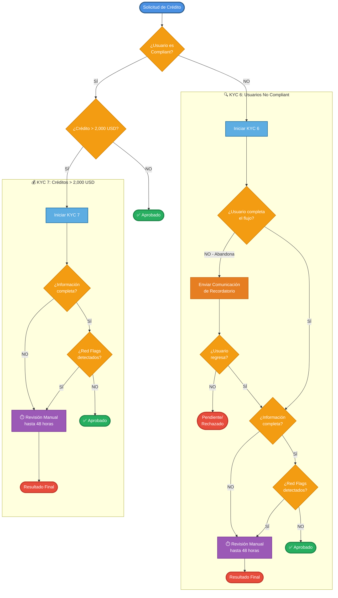

# Flowchart: Flujo de Validación KYC 6 y KYC 7

## Descripción General

Este diagrama representa el flujo completo de validación KYC (Know Your Customer) para solicitudes de crédito, incluyendo:

- **KYC 6**: Validación para usuarios no compliant (post-solicitud de crédito)
- **KYC 7**: Validación para créditos superiores a 2,000 USD

El flujo incluye manejo de abandonos, información incompleta, red flags, y procesos de revisión manual que pueden tomar hasta 48 horas.

---

## Diagrama de Flujo

---

## Leyenda de Símbolos

| Símbolo | Tipo | Descripción |
|---------|------|-------------|
| 🔵 Círculo | Inicio/Fin | Punto de entrada o salida del flujo |
| 🔷 Rectángulo | Proceso | Acción o proceso que se ejecuta |
| 🔶 Rombo | Decisión | Punto de decisión con múltiples caminos posibles |
| 🟣 Rectángulo morado | Revisión Manual | Proceso que requiere intervención humana (48h) |
| 🟠 Rectángulo naranja | Comunicación | Envío de notificaciones o recordatorios |
| 🟢 Círculo verde | Aprobado | Estado final exitoso |
| 🔴 Círculo rojo | Rechazado/Pendiente | Estado final no exitoso |

---

## Colores del Diagrama

- **Azul** 🔵: Inicio, procesos principales
- **Naranja** 🟠: Puntos de decisión
- **Verde** 🟢: Aprobaciones y flujos exitosos
- **Rojo** 🔴: Rechazos o estados pendientes
- **Morado** 🟣: Revisiones manuales
- **Naranja** 🟠: Comunicaciones y notificaciones

---

## Flujos Principales

### 1. Flujo KYC 6 (Usuarios No Compliant)

**Activación**: Usuario no es compliant después de solicitar crédito

**Pasos**:
1. Iniciar proceso KYC 6
2. Verificar si el usuario completa el flujo
   - Si abandona: enviar comunicación y esperar retorno
   - Si completa: continuar validación
3. Validar información proporcionada
4. Verificar red flags
5. Si hay problemas: Revisión Manual (hasta 48h)
6. Resultado: Aprobado o Rechazado

### 2. Flujo KYC 7 (Créditos > 2,000 USD)

**Activación**: Usuario compliant solicita crédito superior a 2,000 USD

**Pasos**:
1. Iniciar proceso KYC 7
2. Validar información completa
3. Verificar red flags
4. Si hay problemas: Revisión Manual
5. Resultado: Aprobado o Rechazado

### 3. Aprobación Directa

**Activación**: Usuario compliant con crédito ≤ 2,000 USD

**Resultado**: Aprobación automática sin KYC adicional

---

## Estados Finales Posibles

| Estado | Descripción |
|--------|-------------|
| ✅ **Aprobado** | Usuario pasó todas las validaciones KYC |
| ❌ **Rechazado** | Usuario no cumple con los requisitos |
| ⏸️ **Pendiente** | Usuario abandonó el flujo y no ha regresado |
| ⏱️ **En Revisión Manual** | Caso requiere análisis humano (hasta 48h) |

---

## Notas Importantes

1. **Tiempo de Revisión Manual**: La revisión manual puede tomar hasta 48 horas
2. **Comunicaciones**: Los usuarios que abandonan KYC 6 reciben recordatorios automáticos
3. **Red Flags**: Cualquier señal de alerta envía el caso a revisión manual
4. **Información Incompleta**: También requiere revisión manual para validación adicional
5. **Múltiples Caminos**: Un usuario puede pasar por varios intentos antes de completar o ser rechazado

---

## Cómo Visualizar Este Diagrama

### Opción 1: GitHub / GitLab
Si este archivo está en un repositorio, GitHub y GitLab renderizarán automáticamente el diagrama Mermaid.

### Opción 2: Visual Studio Code
Instala la extensión "Markdown Preview Mermaid Support" para ver el diagrama directamente.

### Opción 3: Editor Online
Copia el código Mermaid (entre los bloques \`\`\`mermaid) y pégalo en:
- **Mermaid Live Editor**: https://mermaid.live
- **Diagrams.net**: https://app.diagrams.net (importar como Mermaid)

### Opción 4: Exportar a Imagen
Ver instrucciones detalladas en [`KYC_FLOW_INSTRUCTIONS.md`](./KYC_FLOW_INSTRUCTIONS.md)

---

## Versión

- **Versión**: 1.0
- **Fecha**: 2026-02-16
- **Autor**: Generado con Claude Code
- **Última actualización**: 2026-02-16

---

## Actualizaciones Futuras

Para actualizar este diagrama:
1. Editar el código Mermaid directamente en este archivo
2. Validar la sintaxis en https://mermaid.live
3. Actualizar la fecha de última actualización
4. Commitear cambios con mensaje descriptivo

---

*Para instrucciones detalladas sobre cómo exportar este diagrama a Figma, consulta [KYC_FLOW_INSTRUCTIONS.md](./KYC_FLOW_INSTRUCTIONS.md)*
