# 🏦 Merchant Products - Casos de Uso y Convivencia

## 📊 Resumen Ejecutivo

Este documento detalla las reglas de convivencia entre productos de crédito para Merchants, incluyendo productos Legacy y nuevos productos como Línea de Crédito y Préstamo FGBS.

---

## 🎯 Productos Disponibles

### Productos Legacy

| Producto | Descripción | Disponibilidad |
|----------|-------------|----------------|
| **💰 Préstamo en Cuotas Fijas** | Préstamo tradicional con pagos mensuales fijos | Todos los países |
| **⚡ Dinero Express** | Adelanto rápido de dinero con aprobación inmediata | Todos los países |
| **📈 Préstamo por Porcentaje de Ventas (PPV)** | Descuento automático basado en % de ventas | 🇧🇷 Solo Brasil |
| **💵 Adelanto de Dinero** | Adelanto sobre ventas futuras | Todos los países |

### Nuevos Productos

| Producto | Descripción | Modalidades | Disponibilidad |
|----------|-------------|-------------|----------------|
| **🏦 Línea de Crédito** | Línea de crédito flexible con múltiples usos | 1. Fondeo 2. Consumo 3. Full (Fondeo + Consumo) | Todos los países |
| **🇧🇷 Préstamo FGBS** | Préstamo garantizado por el gobierno brasileño | N/A | 🇧🇷 Solo Brasil |

---

## 🔄 Reglas de Convivencia

### ✅ Productos Compatibles (Pueden Convivir)

- **Dinero Express** convive con TODOS los productos
- **Adelanto de Dinero** convive con TODOS los productos
- **PPV** puede convivir con **FGBS**
- **Línea de Crédito** puede activarse mientras hay **Cuotas Fijas** o **Dinero Express** activos

### ❌ Productos Incompatibles (Excluyentes)

- **Cuotas Fijas** ⟷ **PPV** (mutuamente excluyentes)
- **Línea de Crédito Fondeo** sustituye a **Cuotas Fijas** (el CF desaparece)

### 🔄 Transformaciones

**Cuotas Fijas → Línea de Crédito:**
- Cuando un merchant con Cuotas Fijas activa una Línea de Crédito (modalidad Fondeo), el préstamo de Cuotas Fijas se **sustituye automáticamente**
- El merchant ahora tiene Línea de Crédito con el préstamo integrado

---

## 📋 Tabla de Compatibilidad Completa

| Producto Base | Cuotas Fijas | PPV | Dinero Express | LC Fondeo | FGBS | Adelanto |
|---------------|--------------|-----|----------------|-----------|------|----------|
| **Cuotas Fijas** | - | ❌ | ✅ | 🔄 | ✅ | ✅ |
| **PPV** | ❌ | - | ✅ | ⚠️ | ✅ | ✅ |
| **Dinero Express** | ✅ | ✅ | - | ✅ | ✅ | ✅ |
| **LC Fondeo** | 🔄 | ⚠️ | ✅ | - | ✅ | ✅ |
| **FGBS** | ✅ | ✅ | ✅ | ✅ | - | ✅ |
| **Adelanto** | ✅ | ✅ | ✅ | ✅ | ✅ | - |

**Leyenda:**
- ✅ Compatible (pueden convivir)
- ❌ Incompatible (excluyentes)
- 🔄 Sustituye (LC Fondeo reemplaza a Cuotas Fijas)
- ⚠️ Condicional (debe cancelar primero)

---

## 📝 Casos de Uso Detallados

### Caso 1: Merchant con Cuotas Fijas Activo

**Estado Inicial:** Merchant tiene Préstamo en Cuotas Fijas activo

**Opciones Disponibles:**
- ✅ Puede activar Línea de Crédito (Fondeo sustituye el Cuotas Fijas)
- ✅ Puede solicitar Dinero Express (convivencia permitida)
- ✅ Puede solicitar Adelanto de Dinero
- ❌ NO puede tener PPV (excluyente)

**Resultado:** Al activar Línea de Crédito Fondeo, el Cuotas Fijas se sustituye automáticamente.

---

### Caso 2: Merchant en Brasil con PPV

**Estado Inicial:** Merchant brasileño con PPV activo

**Opciones Disponibles:**
- ✅ Puede solicitar Préstamo FGBS (convivencia permitida)
- ✅ Puede solicitar Dinero Express
- ✅ Puede solicitar Adelanto de Dinero
- ❌ NO puede tener Cuotas Fijas (excluyente)
- ⚠️ Si activa Línea de Crédito Fondeo, debe cancelar PPV primero

**Resultado:** Puede tener múltiples productos activos simultáneamente.

---

### Caso 3: Merchant con Dinero Express

**Estado Inicial:** Merchant con Dinero Express activo

**Opciones Disponibles:**
- ✅ Puede activar Línea de Crédito (cualquier modalidad)
- ✅ Puede solicitar Cuotas Fijas
- ✅ Puede solicitar PPV (solo Brasil)
- ✅ Puede solicitar FGBS (solo Brasil)
- ✅ Puede solicitar Adelanto de Dinero

**Resultado:** Dinero Express es el producto más flexible, convive con casi todos.

---

### Caso 4: Merchant sin Productos Activos

**Estado Inicial:** Merchant nuevo sin productos financieros

**Opciones Disponibles:**
- ✅ Puede solicitar Línea de Crédito (Fondeo, Consumo o Full)
- ✅ Puede solicitar Cuotas Fijas
- ✅ Puede solicitar Dinero Express
- ✅ Puede solicitar PPV (solo Brasil)
- ✅ Puede solicitar FGBS (solo Brasil)
- ✅ Puede solicitar Adelanto de Dinero

**Recomendación:** Evaluar necesidad (fondeo vs consumo) y comenzar con Línea de Crédito Full para máxima flexibilidad.

---

### Caso 5: Migración de Cuotas Fijas a Línea de Crédito

**Estado Inicial:** Merchant con Cuotas Fijas quiere migrar

**Proceso:**
1. Merchant solicita Línea de Crédito Fondeo
2. Sistema verifica elegibilidad
3. Si aprueba, el Cuotas Fijas se sustituye automáticamente
4. Merchant ahora tiene Línea de Crédito Fondeo activa

**Ventaja:** Mayor flexibilidad de uso y puede agregar modalidad Consumo después.

---

### Caso 6: Merchant Brasileño con Múltiples Productos

**Escenario Complejo:** Merchant en Brasil con estrategia multi-producto

**Combinación Posible:**
- ✅ PPV activo (para descuento por ventas)
- ✅ FGBS activo (préstamo garantizado)
- ✅ Dinero Express (para emergencias)
- ✅ Adelanto de Dinero (liquidez inmediata)

**Restricción:** No puede tener Cuotas Fijas ni Línea de Crédito Fondeo mientras tenga PPV activo.

---

## 🎯 Modalidades de Línea de Crédito

### 1. Fondeo
- **Propósito:** Capital de trabajo para el negocio
- **Sustituye:** Préstamo en Cuotas Fijas
- **Características:** Solo para fondeo empresarial

### 2. Consumo (BNPL)
- **Propósito:** Buy Now Pay Later para compras personales
- **Características:** Compras diferidas para consumidores
- **Convivencia:** Puede coexistir con otros productos

### 3. Full
- **Propósito:** Fondeo + Consumo
- **Características:** Máxima flexibilidad, ambas funcionalidades
- **Ventaja:** Un solo producto para todas las necesidades

---

## 📊 Flowchart Mermaid

```mermaid
graph TB
    Start([Merchant Solicita Producto]) --> HasProducts{¿Tiene productos activos?}

    HasProducts -->|No| NewMerchant[Merchant Nuevo]
    HasProducts -->|Sí| CheckCurrent[Verificar Productos Actuales]

    NewMerchant --> AllProducts[Puede solicitar cualquier producto]
    AllProducts --> LC[Línea de Crédito]
    AllProducts --> CF[Cuotas Fijas]
    AllProducts --> DE[Dinero Express]
    AllProducts --> PPV[PPV - Solo Brasil]
    AllProducts --> FGBS[FGBS - Solo Brasil]
    AllProducts --> AD[Adelanto de Dinero]

    CheckCurrent --> HasCF{¿Tiene Cuotas Fijas?}
    CheckCurrent --> HasPPV{¿Tiene PPV?}
    CheckCurrent --> HasDE{¿Tiene Dinero Express?}

    HasCF -->|Sí| CFOptions[Opciones con CF Activo]
    CFOptions --> CFtoLC[✅ Puede migrar a LC Fondeo]
    CFOptions --> CFaddDE[✅ Puede agregar Dinero Express]
    CFOptions --> CFaddAD[✅ Puede agregar Adelanto Dinero]
    CFOptions --> CFnoPPV[❌ NO puede PPV]

    CFtoLC --> Substitute[CF se sustituye por LC Fondeo]

    HasPPV -->|Sí| PPVOptions[Opciones con PPV Activo]
    PPVOptions --> PPVaddFGBS[✅ Puede agregar FGBS]
    PPVOptions --> PPVaddDE[✅ Puede agregar Dinero Express]
    PPVOptions --> PPVaddAD[✅ Puede agregar Adelanto Dinero]
    PPVOptions --> PPVnoCF[❌ NO puede Cuotas Fijas]
    PPVOptions --> PPVnoLC[⚠️ NO puede LC Fondeo sin cancelar PPV]

    HasDE -->|Sí| DEOptions[Opciones con DE Activo]
    DEOptions --> DEaddLC[✅ Puede activar LC cualquier modalidad]
    DEOptions --> DEaddCF[✅ Puede agregar Cuotas Fijas]
    DEOptions --> DEaddPPV[✅ Puede agregar PPV - Brasil]
    DEOptions --> DEaddFGBS[✅ Puede agregar FGBS - Brasil]
    DEOptions --> DEaddAD[✅ Puede agregar Adelanto Dinero]

    LC --> LCModes{Modalidad LC}
    LCModes --> LCFondeo[Fondeo: Sustituye CF]
    LCModes --> LCConsumo[Consumo: Gastos personales]
    LCModes --> LCFull[Full: Fondeo + Consumo]

    style Start fill:#667eea,color:#fff
    style NewMerchant fill:#2ecc71,color:#fff
    style CFtoLC fill:#3498db,color:#fff
    style Substitute fill:#e74c3c,color:#fff
    style CFnoPPV fill:#e74c3c,color:#fff
    style PPVnoCF fill:#e74c3c,color:#fff
    style PPVnoLC fill:#f39c12,color:#fff
    style LC fill:#00f2fe,color:#000
    style FGBS fill:#00f2fe,color:#000
    style CF fill:#f5576c,color:#fff
    style PPV fill:#f5576c,color:#fff
    style DE fill:#f5576c,color:#fff
    style AD fill:#f5576c,color:#fff
```

---

## 🎨 Guía para FigJam/Figma

### Colores Sugeridos

| Categoría | Color | Hex | Uso |
|-----------|-------|-----|-----|
| **Legacy** | 🔴 Rojo/Rosa | `#f5576c` | Productos existentes |
| **Nuevo** | 🔵 Azul | `#00f2fe` | Línea de Crédito, FGBS |
| **Compatible** | 🟢 Verde | `#2ecc71` | Convivencia permitida |
| **Incompatible** | 🔴 Rojo | `#e74c3c` | Exclusión mutua |
| **Transformación** | 🟡 Amarillo | `#f39c12` | Cambios/Sustituciones |

### Instrucciones para FigJam

1. **Abrir FigJam** y crear nuevo archivo
2. **Importar sticky notes** para cada producto
3. **Aplicar colores** según la guía de arriba
4. **Usar conectores:**
   - Línea sólida verde (━━━►): Convivencia
   - Línea sólida roja (━━━►): Exclusión
   - Línea punteada (┈┈┈►): Condicional
5. **Agregar iconos emoji** para cada producto
6. **Crear leyenda** en esquina inferior derecha

### Elementos para Incluir

- [ ] Todos los productos Legacy
- [ ] Todos los productos Nuevos
- [ ] Relaciones de convivencia (verdes)
- [ ] Relaciones de exclusión (rojas)
- [ ] Casos especiales de Brasil
- [ ] Leyenda de colores y símbolos
- [ ] Notas sobre transformación CF → LC

---

## 🚫 Reglas Críticas

### Regla 1: Exclusión CF ⟷ PPV
- Si un merchant tiene Cuotas Fijas, NO puede tener PPV
- Si un merchant tiene PPV, NO puede tener Cuotas Fijas
- Son mutuamente excluyentes

### Regla 2: Sustitución LC Fondeo → CF
- Al activar Línea de Crédito Fondeo, el préstamo de Cuotas Fijas se sustituye automáticamente
- No coexisten, es una transformación

### Regla 3: Productos Solo Brasil
- PPV: Solo disponible en Brasil
- FGBS: Solo disponible en Brasil

### Regla 4: Máxima Compatibilidad
- Dinero Express: Convive con TODOS
- Adelanto de Dinero: Convive con TODOS

---

## 📦 Archivos Generados

1. **merchant-products-flowchart.html** - Visualización interactiva con tabs
2. **merchant-products-flowchart.md** - Este documento (documentación completa)

### Cómo Usar el HTML

1. Abre el archivo `merchant-products-flowchart.html` en tu navegador
2. Navega por las 4 pestañas:
   - **Overview**: Vista general de productos
   - **Casos de Uso**: 6 casos detallados
   - **Flowchart**: Diagrama interactivo
   - **Reglas**: Tabla de compatibilidad
3. Usa el botón "Imprimir" para guardar como PDF
4. Usa el botón "Copiar Código Mermaid" para exportar a FigJam

---

## 📅 Información del Documento

- **Fecha de creación:** 2026-02-17
- **Versión:** 3.0
- **Autor:** MercadoLibre - Merchant Credit Products
- **Última actualización:** 2026-02-17

---

**Notas Finales:**
- Este documento debe actualizarse cuando cambien las reglas de negocio
- El flowchart HTML es la versión más completa y recomendada
- Para presentaciones, usar el código Mermaid en herramientas compatibles
